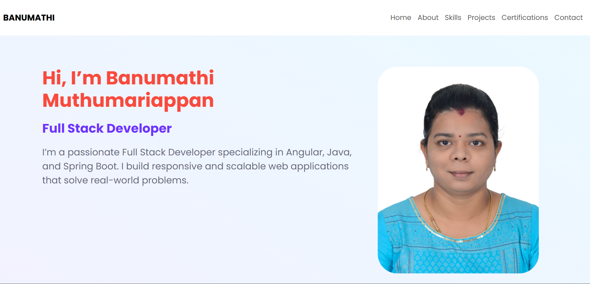
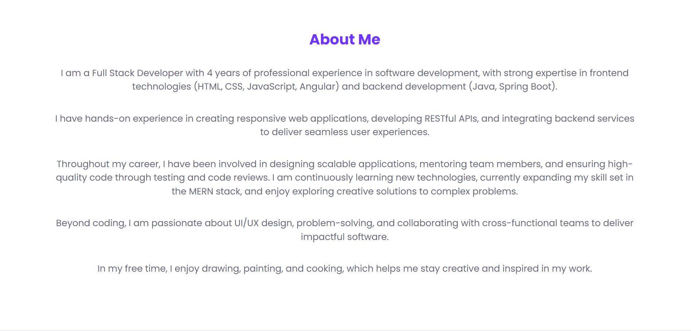
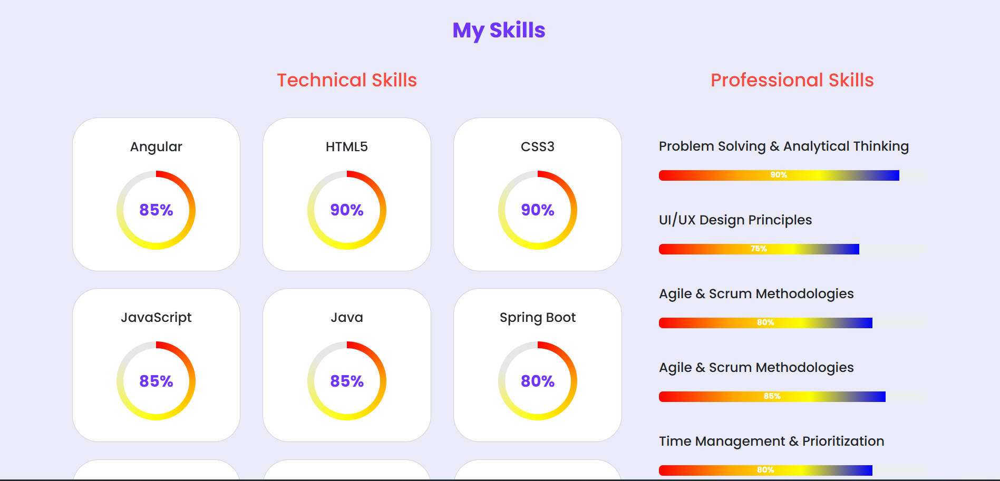
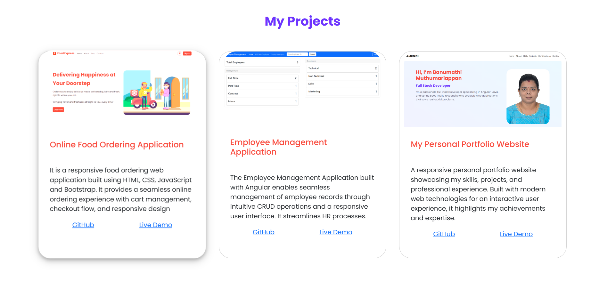
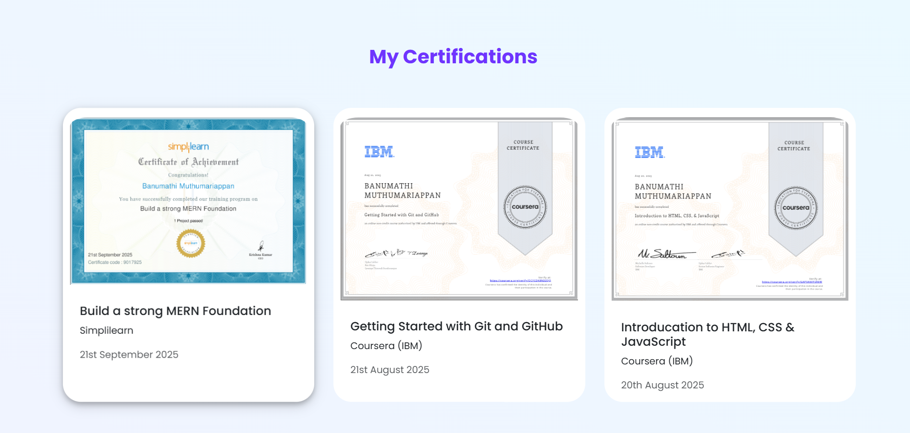
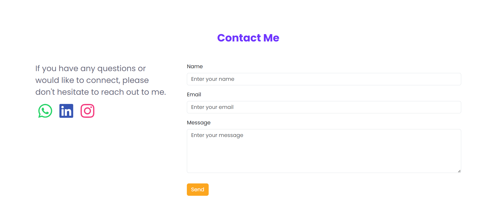
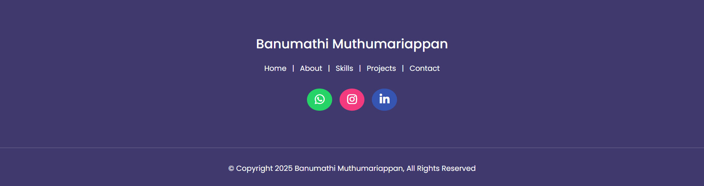

# My Personal Portfolio Website - Banumathi Muthumariappan

> 🚀 This is my personal portfolio website, showcasing my skills, projects, certifications, and professional experience as a Full Stack Developer.

The website is built using HTML, CSS, JavaScript, and Bootstrap with animations and responsive design.

## 🧐 About

This repository contains my personal portfolio website. The site is designed to present my skills, projects, certifications, and enable visitors to get in touch with me.

I am a Full Stack Developer with experience in Angular, Java, Spring Boot, and frontend technologies. This portfolio serves as my digital presence.

## ✅ Features

🎨 Modern UI/UX – Clean, professional, and responsive layout.

🏠 Home Section – Introduction with animated content.

👩‍💻 About Section – Overview of my background and interests.

⚡ Skills Section – Technical and professional skills with animated progress indicators.

💼 Projects Section – Portfolio of completed projects with GitHub links and live demos.

🎓 Certifications Section – Showcase of professional certificates.

📬 Contact Section – Contact form with social media links.

📱 Responsive Design – Optimized for desktop, tablet, and mobile devices. 

## 🛠 Tech Stack

- **HTML5**  
- **CSS3**  
- **JavaScript (ES6+)**  
- **Bootstrap 5**  
- **Google Fonts (Poppins)**  
- **Font Awesome**  

## ✅ Getting Started

### Clone the repository

- git clone https://github.com/banumathimuthumariappan-gif/My-Personal-Portfolio-Website.git
- cd My-Personal-Portfolio-Website

### Open in Browser
- Just open the index.html file in your browser.
- (You can also use a live server extension in VS Code for development.)

## ✅ Getting Started

My-Personal-Portfolio-Website/

│── index.html         # Main HTML File

│── /css

│   ├── styles.css     # Custom Styles

│── /js

│   ├── app.js        # JavaScript animations & interactivity

│── assets/            # Images (profile picture, project screenshots, certificates)

│── README.md          # Project Documentation

│── App-Screenshots     # Application screenshots

## 📷 Screenshots

## 📬 Contact
- Portfolio Website: Live Demo
- LinkedIn: [linkedin.com/in/banumathi-muthumariappan](https://www.linkedin.com/in/banumathi-muthumariappan-49799837b/)
- GitHub: [github.com/banumathimuthumariappan-gif](https://github.com/banumathimuthumariappan-gif/My-Personal-Portfolio-Website/#)